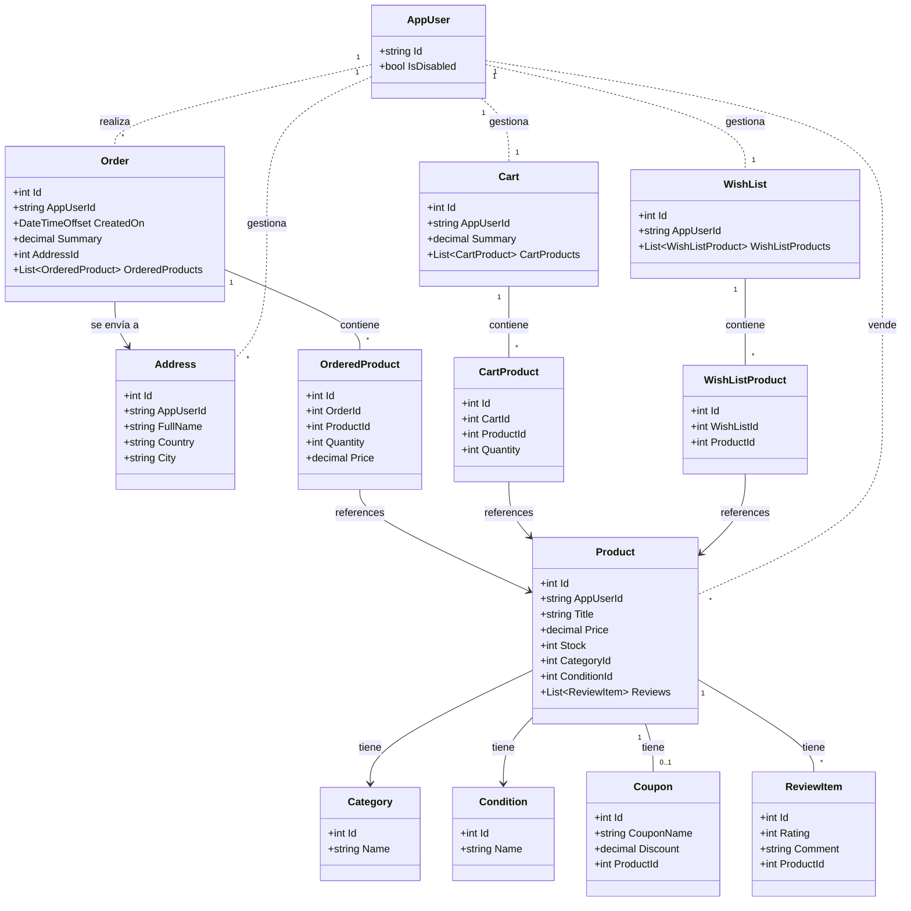

  

# Alexpress - Plataforma E-commerce

Plataforma de comercio electrónico inspirada en Aliexpress.

## Tech Stack

El proyecto utiliza un stack moderno enfocado en rendimiento y escalabilidad:

*   **Frontend:** Angular, TailwindCSS.
*   **Backend:** ASP.NET Core.
*   **Data:** Entity Framework Core, SQL Server.
*   **Cloud y servicios:** Microsoft Azure, Stripe, Cloudinary.

## Arquitectura y patrones

El sistema implementa una arquitectura en capas (Controller-Service-Repository).

*   **Bounded Contexts lógicos:** Se utilizan múltiples `DbContexts` para segregar responsabilidades de negocio (Inventario, Identidad, Ventas).
*   **Outbox Messages:** Implementación del Patrón Outbox utilizando un BackgroundService. Esto garantiza la ejecución confiable de tareas secundarias (como el envío de correos de confirmación y resúmenes de compra) al persistirlas en la base de datos (OutboxMessages) y procesarlas de forma asíncrona.
*   **Patrones Implementados:**
    *   **Repository Pattern:** Abstracción del acceso a datos.
    *   **Unit of Work:** Gestión de transacciones atómicas distribuidas entre múltiples DbContexts de base de datos.
    *   **Dependency Injection:** Desacoplamiento de dependencias para facilitar el testing y mantenimiento.

## Esquema de base de datos

## Autenticación y seguridad

*   **ASP.NET Core Identity:** Gestión robusta de usuarios y roles.
*   **Token-Based Authentication:** Implementación de JWT (JSON Web Tokens) con Refresh Tokens para manejo seguro de sesiones de larga duración.
*   **Two-Factor Authentication (2FA):** Soporte para autenticación de doble factor mediante QR compatibles con Google Authenticator.
*   **Account Recovery:** Flujos seguros de recuperación de contraseña vía email y in-app.

## Integraciones externas

El sistema se conecta con servicios de terceros para funcionalidades críticas:

*   **Stripe:** Procesamiento de pagos seguro mediante Webhooks, permitiendo la confirmación asíncrona y resiliente de las órdenes.
*   **Azure AI Content Safety:** Moderación automática de contenido visual y textual al momento de publicar productos, previniendo contenido inapropiado.
*   **Cloudinary:** Almacenamiento de imágenes en la nube.

## Funcionalidades principales

Descripción de las capacidades clave de la plataforma:

*   **Gestión de catálogo:**
    *   Publicación de productos con moderación automática (IA).
    *   Filtrado avanzado por rating, rango de precios, título y categorías.
*   **Sistema de compras:**
    *   Checkout seguro integrado con Stripe.
    *   Aplicación de cupones de descuento ofrecidos por el vendedor.
*   **Gestión de Ventas:**
    *   Creación y administración de cupones vinculados a productos específicos.
*   **Rating:**
    *   Sistema de reseñas y calificaciones por producto.
    *   Visualización de opiniones de otros compradores.

---
Hecho por [Alejandro.NET](https://alejandropg845.github.io/resume)
