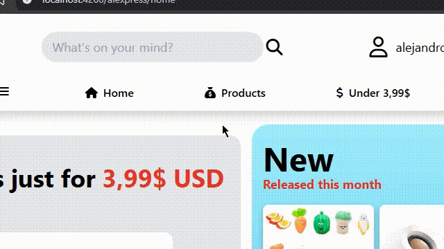
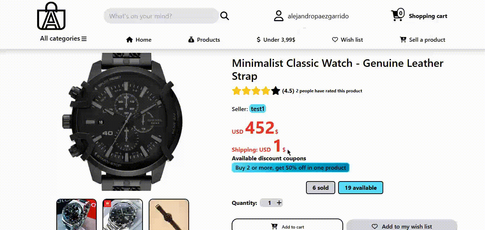
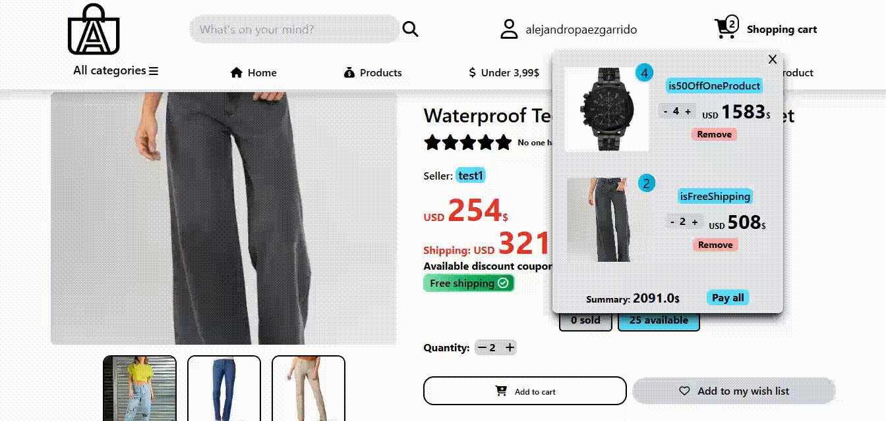
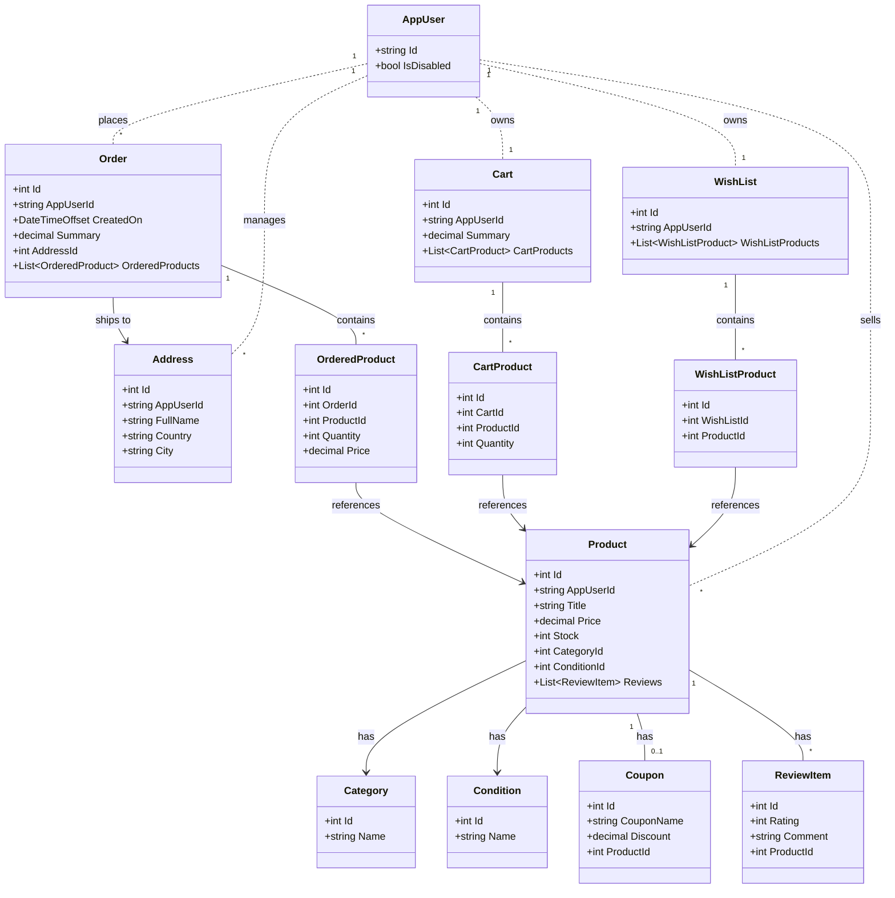

  

# Alexpress - E-commerce platform

E-commerce platform inspired by Aliexpress.

# Project demo & features

## Identity & 2FA
A complete implementation of Two-Factor Authentication (2FA) using QR Codes and Authenticator apps (Google/Microsoft), including backup recovery codes.

| Enabling 2FA | 2FA Login flow |
| :---: | :---: |
|  |  |
| User scans QR & verifies code | Login requires password + OTP |

## Stripe checkout flow
Full transactional flow and secure payments via Stripe.

#### 1. Dynamic cart & coupons
Real-time interaction with the shopping cart and discount application.

#### 2. Secure checkout flow
Redirection to Stripe's secure gateway and payment processing.

#### 3. Order summary email
Email with order summary is sent once checkout finishes.

### AI content moderation
Integration with Azure Content Safety to automatically block NSFW images and offensive text (title, description) in product.

| Safety Content |
| :---: |
|  |
| Azure AI blocking offensive content |

# Deployment

> 💡 **Note:** This project is deployed on Azure for easy access. Since this project integrates multiple services (Azure AI, Stripe, Cloudinary, Gmail), running it locally requires complex configuration. If you want to try a project of mine locally, please, check my containerized [Scrum Task Manager](https://github.com/alejandropg845/scrum-task-manager) repository.
>

   
  
   

## Tech stack

*   **Frontend:** Angular, TailwindCSS.
*   **Backend:** ASP.NET Core.
*   **Data:** Entity Framework Core, SQL Server.
*   **Cloud & services:** Microsoft Azure, Stripe, Cloudinary.

## Architecture and patterns

The system implements a layered architecture (Controller-Service-Repository).

*   **Logical bounded contexts:** Multiple `DbContexts` are used to segregate business responsibilities (Inventory, Identity, Sales).
*   **Outbox Messages:** Implementation of the Outbox Pattern using a BackgroundService worker. This ensures reliable execution of side effects (like sending email confirmations and purchase summaries) by persisting tasks to the database (OutboxMessages) and processing them asynchronously.
*   **Implemented patterns:**
    *   **Repository pattern:** Data access abstraction.
    *   **Unit of work:** Management of atomic distributed transactions across multiple database contexts.
    *   **Dependency injection:** Dependency decoupling to facilitate testing and maintenance.

## Database schema

## Authentication and security

*   **ASP.NET Core Identity:** Robust user and role management.
*   **Token-based authentication:** JWT (JSON Web Tokens) implementation with Refresh Tokens for secure long-lived session management.
*   **Two-factor authentication (2FA):** Support for two-factor authentication via QR codes compatible with Google Authenticator.
*   **Account recovery:** Secure password recovery flows via email and in-app.

## External integrations

The system connects with third-party services for critical functionalities:

*   **Stripe:** Secure payment processing via Webhooks, allowing asynchronous and resilient order confirmation.
*   **Azure AI Content Safety:** Automatic moderation of visual and textual content when publishing products, preventing inappropriate content.
*   **Cloudinary:** Cloud image storage.

## Main features

Description of the platform's key capabilities:

*   **Catalog management:**
    *   Product publishing with automatic moderation (AI).
    *   Advanced filtering by rating, price range, title, and categories.
*   **Shopping system:**
    *   Secure checkout integrated with Stripe.
    *   Application of discount coupons offered by the seller.
*   **Sales management:**
    *   Creation and administration of coupons linked to specific products.
*   **Rating:**
    *   Review and rating system per product.
    *   Visualization of opinions from other buyers.

Made by [Alejandro.NET](https://alejandropg845.github.io/resume)
